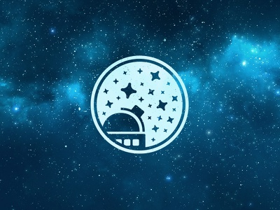

# AstroCam (Flask + Mongo)

A Raspberry Pi–based telescope camera system built using Flask and MongoDB.

The system is designed to control a Pi camera attached to a telescope, capture astrophotography images, organise observing sessions, and provide a remote web interface for control and monitoring.

---

## Overview

AstroCam replaces a browser-based webcam model with a **server-side camera architecture**:

- Camera runs on Raspberry Pi
- Flask controls capture and streaming
- MongoDB stores metadata and sessions
- Browser acts as remote UI/dashboard

---

## Core Architecture

```

[ Browser UI ]
│
▼
[ Flask App (Pi) ]
│
├── Camera Control (Picamera2)
├── Capture Service
├── Preview Service
├── Session Manager
│
▼
[ File Storage ]  (images/videos)
│
▼
[ MongoDB ]  (metadata, sessions, settings)

```

---

## Project Structure

```

astrocam/
├── app.py
├── config.py
├── requirements.txt
├── .env
│
├── routes/
│   ├── main_routes.py
│   ├── camera_routes.py
│   ├── session_routes.py
│   └── api_routes.py
│
├── services/
│   ├── camera_service.py
│   ├── capture_service.py
│   ├── preview_service.py
│   └── storage_service.py
│
├── database/
│   └── connection.py
│
├── models/
│   ├── capture_model.py
│   ├── session_model.py
│   └── settings_model.py
│
├── templates/
│   ├── base.html
│   ├── dashboard.html
│   ├── camera.html
│   ├── gallery.html
│   └── session.html
│
├── static/
│   ├── css/
│   ├── js/
│   └── img/
│
├── captures/
│   ├── stills/
│   ├── previews/
│   └── sessions/
│
└── utils/
└── time_utils.py

```

---

## Core Features (Phase 1 → Production Path)

### Camera Control
- Capture still images from Pi camera
- Adjustable exposure, gain, resolution
- Preview feed (snapshot or MJPEG)
- Manual trigger via UI

### Capture System
- Save images to filesystem
- Generate preview thumbnails
- Timestamped filenames
- Metadata logging to Mongo

### Session Management
- Create observing sessions
- Assign target (e.g. M42, Jupiter)
- Attach notes and conditions
- Group captures per session

### Gallery
- View captured images
- Filter by:
  - session
  - target
  - date
- Full resolution viewer
- Delete/download

### Metadata Tracking (Mongo)
- Exposure settings
- Capture time
- Resolution
- Session linkage
- User notes

---

## Data Model

### capture_sessions
```

{
_id,
name,
target,
started_at,
ended_at,
notes,
status
}

```

### captures
```

{
_id,
session_id,
filename,
filepath,
type,
captured_at,
exposure_ms,
gain,
iso,
width,
height,
notes
}

```

### camera_settings
```

{
preview_width,
preview_height,
still_width,
still_height,
default_exposure_ms,
default_gain,
flip_horizontal,
flip_vertical
}

```

---

## Development Milestones

### Phase 1 — Core Backend (Critical Path)
- [ ] Flask app scaffold
- [ ] MongoDB connection
- [ ] Basic Pi camera integration (Picamera2)
- [ ] `/capture` route (save still image)
- [ ] File storage structure
- [ ] Insert capture metadata into Mongo
- [ ] Basic dashboard showing latest captures

---

### Phase 2 — Usable System
- [ ] Camera control page
- [ ] Exposure + gain controls
- [ ] Preview system (snapshot refresh or MJPEG)
- [ ] Session creation + selection
- [ ] Link captures to sessions
- [ ] Basic gallery UI

---

### Phase 3 — Workflow Improvements
- [ ] Thumbnail generation
- [ ] Capture history filters
- [ ] Notes per capture
- [ ] Bulk delete/download
- [ ] Persistent camera settings

---

### Phase 4 — Advanced Astro Features
- [ ] Interval capture (timelapse / stacking)
- [ ] Dark frame / flat frame support
- [ ] Capture presets (planetary, deep sky)
- [ ] Exposure bracketing
- [ ] Star tracking integration (if mount supports it)

---

### Phase 5 — Automation & Intelligence
- [ ] Scheduled capture jobs
- [ ] Weather-aware capture logic
- [ ] Target database (Messier, planets)
- [ ] Auto-session creation
- [ ] Basic image quality scoring

---

### Phase 6 — Remote Access & Production
- [ ] Authentication (local + remote)
- [ ] Secure API endpoints
- [ ] Cloudflare Tunnel / Tailscale access
- [ ] Logging + error tracking
- [ ] Backup strategy for captures

---

## Key Design Decisions

### Camera runs server-side
Avoid browser `getUserMedia()` model. Camera must be controlled directly by the Pi.

### Filesystem for images
Images stored on disk for performance and scalability. Mongo stores metadata only.

### Modular services
Camera, capture, preview, and storage logic are separated for maintainability.

### Stateless UI
Frontend acts as a control panel, not a processing layer.

---

## Initial Build Target

Minimal working system:

1. Flask app runs
2. Mongo connects
3. Pi camera captures image
4. Image saved to `/captures/stills`
5. Metadata stored in Mongo
6. Dashboard displays latest image

No preview, no sessions, no advanced UI initially.

---

## Hardware Integration (Pending)

To be defined once hardware is provided:

- Raspberry Pi model
- Camera module type (e.g. HQ camera, v2)
- Telescope mount (manual / motorised / GoTo)
- Focus mechanism (manual / electronic)
- Additional sensors (temperature, sky quality, etc.)

---

## Future Extensions

- Integration with telescope control protocols
- Plate solving (astrometry)
- Image stacking pipeline
- AI-assisted target recommendation
- Integration into broader smart-home / cisOne ecosystem

---

## Notes

This project is intentionally backend-first.  
UI should only be built once capture and storage are reliable.

Avoid premature complexity:
- no WebRTC initially
- no streaming until capture is stable
- no heavy frontend frameworks

---
